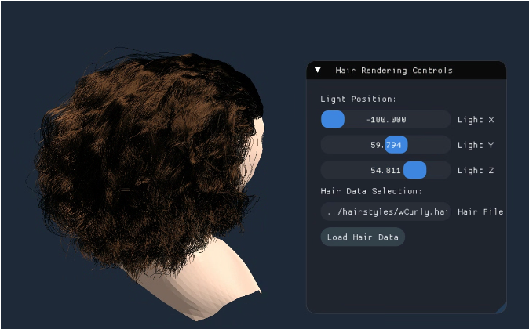

# Real-Time Hair Rendering with Marschner Model

A real-time hair rendering system based on the Marschner scattering model, optimized using LUT (Look-Up Textures) and OpenGL shaders.  
This project simulates realistic light scattering behaviors of human hair including R, TT, and TRT reflection modes.

---

## 📌 Features

- Physically-based hair scattering using **Marschner's model**
- Precomputed **LUT textures (M, NR, NTT, NTRT)** for real-time performance
- **Geometry Shader** based strand expansion (Line Strip)
- **Slab-based transparency rendering** (depth peeling & alpha blending)
- Supports custom hair models from `.data`, `.obj`, or `HAIR` format

---

## 🖼️ Demo

> Real-time rendering result with physically-based scattering

---

##  Technical Overview

###  Marschner Scattering Model
Implements R (surface reflection), TT (transmission-reflection), TRT (transmission-reflection-transmission) using:

- Longitudinal scattering `M(θi, θo)`
- Azimuthal scattering `N(ϕd)`
- Absorption & Fresnel reflectance based on hair fiber properties

###  LUT Precomputation
- Precomputed 2D textures for `M`, `N_R`, `N_TT`, `N_TRT`
- Indexed by `cos(θd)`, `cos(ϕd)` and loaded in fragment shader

###  Strand Rendering
- Rendered as `GL_LINE_STRIP`
- Geometry shader duplicates and offsets lines for visual thickness
- Transparency modulated by viewing angle & depth sorting

---

## 🗂️ Folder Structure

