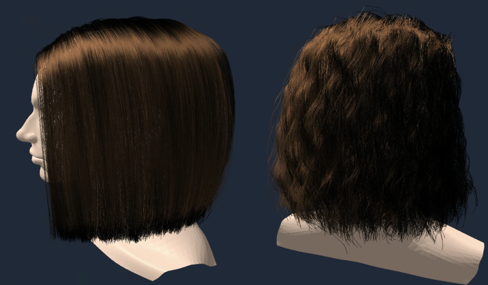
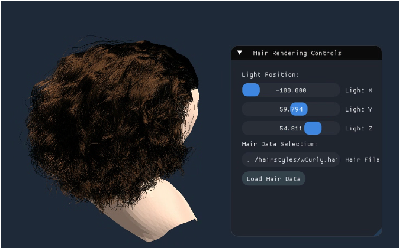
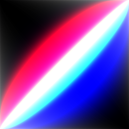
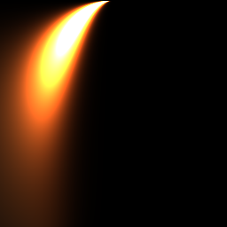
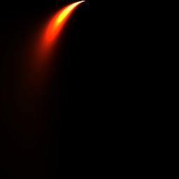

# Real-Time Hair Rendering with Marschner Model

A real-time hair rendering system based on the Marschner scattering model, optimized using LUT (Look-Up Textures) and OpenGL shaders.  
This project simulates realistic light scattering behaviors of human hair including R, TT, and TRT reflection modes.

---

## Features

- Physically-based hair scattering using **Marschner's model**
- Precomputed **LUT textures (M, NR, NTT, NTRT)** for real-time performance
- Supports custom hair models from `.HAIR` format

---

##  Demo

> Real-time rendering result with physically-based scattering

The renderer includes a minimal GUI for real-time interaction:
- **Change hairstyle**: Select different hair files (e.g., straight, wavy, curly)
- **Adjust light position**: Move the directional light source to observe scattering and specular variation
-  **Camera controls**: Rotate and zoom freely to inspect hair from various angles
---

##  Technical Overview

### Marschner Scattering Model

Implements R (surface reflection), TT (transmission-transmission), TRT (transmission-reflection-transmission) using:

  
  
  
  

- **First**: `M(θi, θo)` – Longitudinal scattering
- **Second**: `N_R(ϕd)` – Azimuthal scattering for R
- **Third**: `N_TT(ϕd)` – Azimuthal scattering for TT
- **Fourth**: `N_TRT(ϕd)` – Azimuthal scattering for TRT
- Absorption & Fresnel reflectance based on hair fiber properties

###  LUT Precomputation
- Precomputed 2D textures for:
  - `M(θi, θo)` → indexed by `sin(θi)`, `sin(θo)`
  - `N_R(ϕd)`, `N_TT(ϕd)`, `N_TRT(ϕd)` → indexed by `cos(θd)`, `cos(ϕd)`
- All LUTs are loaded in the fragment shader 

---

## Dataset

All hair models used in this project are from the following open dataset:

-  **Cem Yuksel's Hair Models**  
  Website: [https://www.cemyuksel.com/research/hairmodels/](https://www.cemyuksel.com/research/hairmodels/)  
  Format: `.HAIR` – a strand-based file format for simulating and rendering human hair  
  License: Free for research and educational purposes (non-commercial)

---

## Work in Progress

- **Strand Duplication for Density**  
  A geometry shader-based approach is planned to duplicate strands with slight offsets in order to simulate fuller, more volumetric hair.  

- **Depth-sorted alpha blending**                                     
  A framework for transparency and per-pixel depth sorting is under development.

- **Hair Self-Shadowing**  
  Shadow mapping framework is being extended to support self-shadowing between hair and the underlying head geometry.

---
